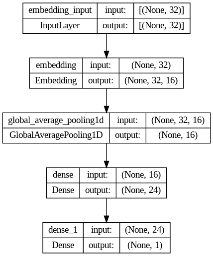
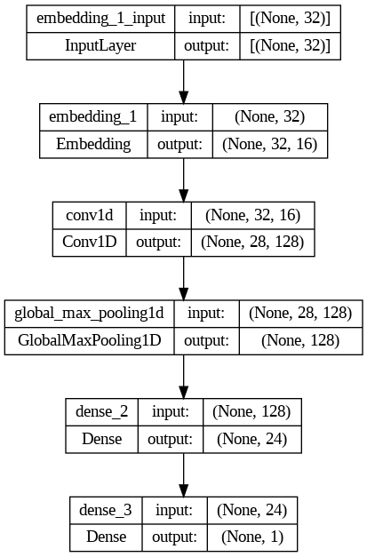
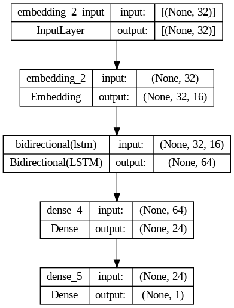
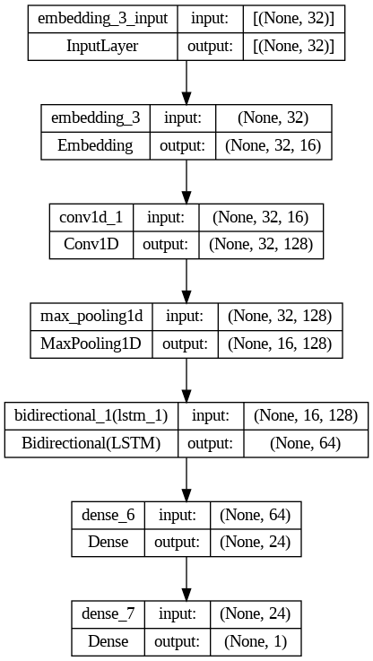
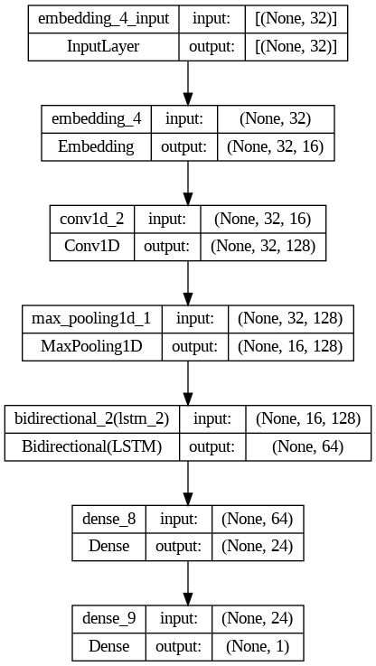
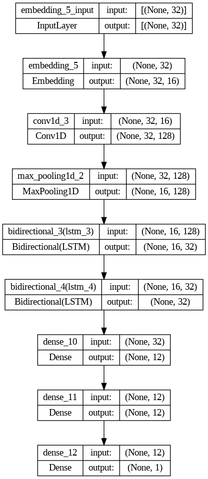
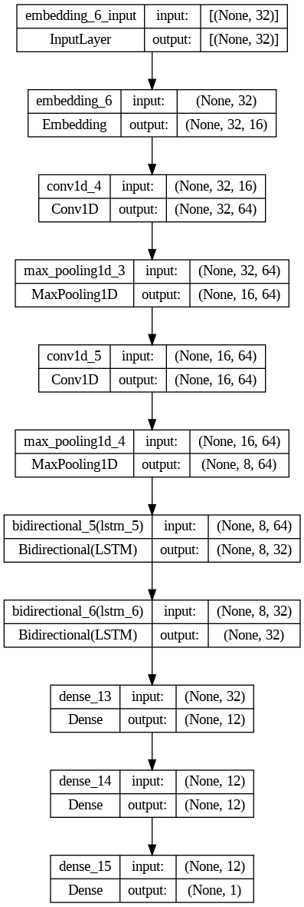

# Sarcasm Detection in News Headlines

## Introduction

Welcome to the Sarcasm Detection in News Headlines project! In a world where news headlines often blur the lines between humor and seriousness, we embark on a journey to teach machines the subtle art of sarcasm detection.

## Overview

Detecting sarcasm in news headlines has far-reaching implications, from enhancing content filtering on social media platforms to providing more accurate sentiment analysis of news articles. Our mission is to empower machines to grasp the nuances of sarcasm, ultimately leading to more insightful information analysis.

## Dataset

Our project relies on a meticulously curated dataset of news headlines, with each headline carefully labeled as sarcastic or non-sarcastic. This dataset forms the bedrock of our project, serving as the training and evaluation data. Access the dataset [here](link-to-dataset).

## Model Architectures

Our exploration of machine learning has given rise to a diverse range of models, each tailored to the unique challenges of sarcasm detection. We've harnessed cutting-edge techniques, including convolutional neural networks (CNNs), recurrent neural networks (RNNs), and more. Here's a glimpse of some key models:

### Model 1 Architecture 

### Model 2 Architecture

### Model 3 Architecture

### Model 4 Architecture

### Model 5 Architecture

### Model 6 Architecture

### Model 7 Architecture

These models have undergone rigorous training and fine-tuning to excel at sarcasm detection. Dive into the code to explore their inner workings!

## Getting Started

Use the ipynb file in the repository in google colab and upload your kaggle.json file from Kaggle or upload the dataset provided in the repository

## Legal Considerations

This project is governed by the MIT License, which outlines how you can use, modify, and share this work. For comprehensive licensing details, consult the [LICENSE](LICENSE) file.

Join us on this exciting journey to unravel the subtleties of sarcasm in news headlines!
